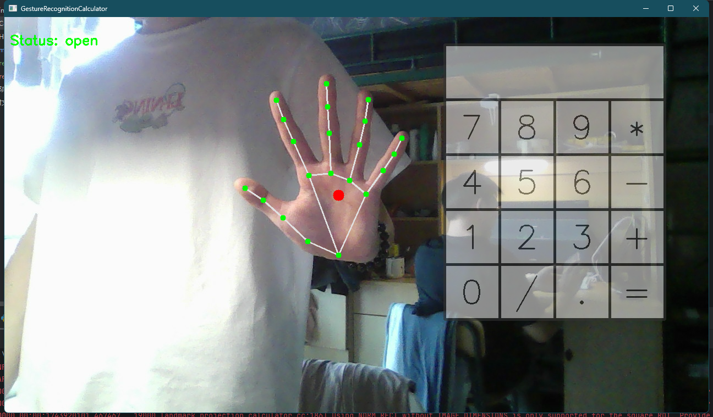
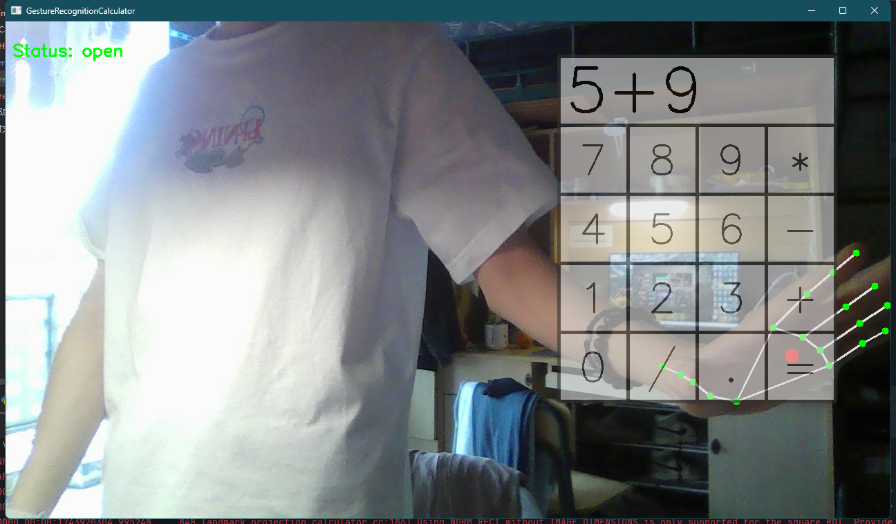

# 基于mediapipe的手势识别计算器

---
## 2025Python机器学习期中大作业

## 示例

---

## 功能

---
1. 识别手势
2. 当掌心移动到数字上后，闭合手掌可以选择按键
3. 根据按键计算结果
4. ESC键退出

## 参考
[AI视觉，远程手势控制虚拟计算器](https://blog.csdn.net/dgvv4/article/details/122082894)